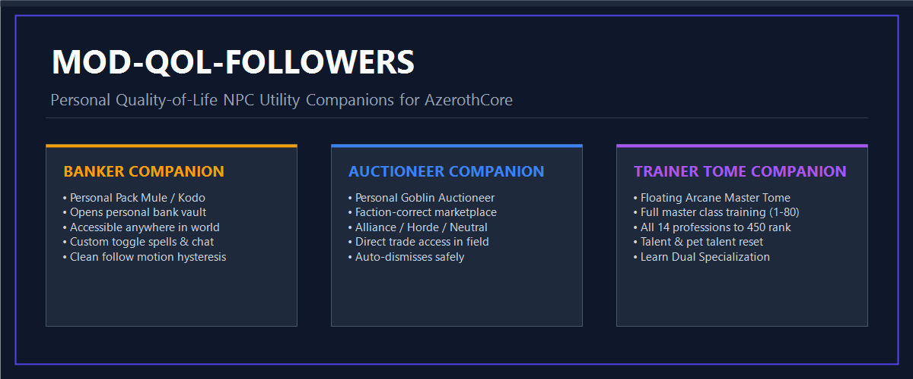

# mod-QOL-followers for AzerothCore (WotLK 3.3.5a)

<p align="center">
  
</p>

<p align="center">
  <a href="https://github.com/azerothcore/azerothcore-wotlk"></a>
  <a href="https://github.com/Ildourol/mod-QOL-followers/blob/master/conf/mod_qol_followers.conf.dist"></a>
  <a href="https://github.com/Ildourol/mod-QOL-followers/blob/master/acore-module.json"></a>
</p>

---

## Description

**mod-QOL-followers** is a standalone AzerothCore C++ module providing player-owned utility NPC companions for World of Warcraft: Wrath of the Lich King (3.3.5a).

Followers physically accompany their master across the world with smooth movement hysteresis and collision avoidance, offering essential town services through intuitive gossip dialogues. Each follower can be summoned individually via dedicated player spells or chat commands.

---

## Companions

### 1. Banker Follower
- **Horde Appearance**: Pack Kodo (Display ID `7933`, Creature Entry `10636`)
- **Alliance Appearance**: Pack Mule (Display ID `14546`, Creature Entry `16225`)
- **Services**:
  - `Open Bank` - Access your personal bank vault anywhere across the open world.
  - `Dismiss` - Safely unsummons the banker.

### 2. Auctioneer Follower
- **Appearance**: Goblin Auctioneer (Display ID `7993`, Creature Entry `8661`)
- **Faction Correctness**: Automatically inherits the player's faction, opening Alliance, Horde, or Neutral Auction House dialogues appropriately.
- **Services**:
  - `Open Auction House` - Browse, bid, and list auctions directly in the field.
  - `Dismiss` - Safely unsummons the auctioneer.

### 3. Medivh Follower (Trainer & Teleporter)
- **Appearance**: Medivh, The Last Guardian (Display ID `18718`, Creature Entry `15608`)
- **Hierarchical Services**:
  - **Teleportation**: Comprehensive faction-aware teleportation network:
    - **Neutral Hubs**: Dalaran (Northrend) and Shattrath City (Outland).
    - **Alliance Capitals**: Stormwind City, Ironforge, Darnassus, and The Exodar.
    - **Horde Capitals**: Orgrimmar, Undercity, Thunder Bluff, and Silvermoon City.
    - **Dungeons (Full Vanilla, TBC & Wrath)**:
      - *Classic*: Ragefire Chasm, Deadmines, Wailing Caverns, Shadowfang Keep, Blackfathom Deeps, Stockade, Gnomeregan, Razorfen Kraul, Scarlet Monastery, Razorfen Downs, Uldaman, Zul'Farrak, Maraudon, Sunken Temple, Blackrock Depths, Lower Blackrock Spire, Upper Blackrock Spire, Stratholme, Scholomance, Dire Maul.
      - *The Burning Crusade*: Hellfire Ramparts, Blood Furnace, Shattered Halls, Slave Pens, Underbog, Steamvault, Mana-Tombs, Auchenai Crypts, Sethekk Halls, Shadow Labyrinth, Durnholde Keep, Black Morass, Mechanar, Botanica, Arcatraz, Magisters' Terrace.
      - *Wrath of the Lich King*: Utgarde Keep, Utgarde Pinnacle, Nexus, Oculus, Azjol-Nerub, Ahn'kahet, Drak'Tharon Keep, Gundrak, Violet Hold, Halls of Stone, Halls of Lightning, Culling of Stratholme, Trial of the Champion, Forge of Souls, Pit of Saron, Halls of Reflection.
    - **Raids (Full Vanilla, TBC & Wrath)**:
      - *Classic*: Molten Core, Blackwing Lair, Ruins of Ahn'Qiraj, Temple of Ahn'Qiraj, Onyxia's Lair, Zul'Gurub.
      - *The Burning Crusade*: Karazhan, Gruul's Lair, Magtheridon's Lair, Serpentshrine Cavern, Tempest Keep (The Eye), Battle for Mount Hyjal, Black Temple, Sunwell Plateau, Zul'Aman.
    - **Other Destinations**: Karazhan, Caverns of Time, Gadgetzan, and Booty Bay.
  - **Class Training**: Automatically detects the player's class and faction with verified native trainer templates, opening the complete trainer spell window directly up to level 80.
  - **Professions**: Submenus for all 11 Primary Professions and 3 Secondary Professions, backed by neutral Dalaran Grand Master trainers up to rank 450.
  - **Talent Services**: Reset class talents (with progressive cost scaling) and reset pet talents for hunters.
  - **Dual Specialization**: Learn dual specialization at level 40+ with standard 1,000 gold requirement.
  - **Dismiss**: Safely unsummons Medivh.

---

## Movement and Following Mechanics

Followers utilize an **unanchored steering model** instead of the rigid native pet follow generator (which hard-anchors pets to 135° on the left and triggers on micro-movements of 0.25 yards):
- **Free-Angle Steering**: Followers approach along their natural line-of-sight vector (`owner->GetAngle(me)`). They are never locked to your left flank and do not swarm your field of view.
- **Rotational Deadzone**: Companions remain relaxed and idle when the player pivots, turns, or makes minor adjustments in place.
- **`FollowDistance`** (`3.5` yards): Target rest distance from the player once moving.
- **`StartFollowingDistance`** (`7.0` yards): Wide movement hysteresis threshold — follower only begins walking/running when the player moves more than 7 yards away.
- **Constant Default Speed**: Followers always travel at their natural, default creature run speed without unnatural speed-ups when left behind. If the player sprints or mounts far ahead (> 30 yards), the companion smoothly teleports into range.
- **`CatchUpDistance`** (`30.0` yards): If the player flies away, mounts a fast mount, or uses high-speed movement abilities, the follower smoothly teleports nearby without runaway pathfinding.
- **Single Active Follower Default**: `UtilityFollowers.MaxActive = 1` with `ReplaceOldest` policy ensures clean single-companion operation without manual dismissal overhead.

---

## Dedicated Summon Spells

Each follower can be summoned and dismissed via its own dedicated conflict-free spell (available by default at level 10 via `UtilityFollowers.Spells.DefaultLearnLevel = 10`):
- **Summon Banker**: Spell `87094` (*Summon Banker*, Icon: `inv_misc_coin_02` [Gold Coin])
- **Goblin Auctioneer**: Spell `87093` (*Goblin Auctioneer*, Icon: `achievement_goblinhead` [Goblin Head])
- **Summon Medivh**: Spell `87092` (*Summon Medivh*, Icon: `Spell_Nature_RavenForm` [Raven Form])

### Clean Spellbook & Action Bar Integration
- **Zero Action Bar Clutter**: When learned, follower summon spells are added cleanly into your Spellbook without automatically occupying or cluttering action bar slots (`UtilityFollowers.Spells.PreventActionBarAutoAdd = 1`). Players may manually drag them from the Spellbook onto action bars at any time.
- **Zero DB Conflicts**: Uses dedicated, clean spell IDs with no focus requirements, no area restrictions (e.g. Master's Terrace), and no reagent costs.

### Toggle Behavior
- When absent: Casting the spell summons the corresponding follower.
- When present: Casting the spell dismisses that follower.
- Spells can be dragged from the General tab of the spellbook to action bars.

---

## Chat Commands

Optional player chat commands (`SEC_PLAYER`):
```text
.utility banker     - Toggle Banker follower
.utility auctioneer - Toggle Auctioneer follower
.utility medivh     - Toggle Medivh (Trainer & Teleporter)
.utility dismiss    - Dismiss all active utility followers
.utility            - Show command list and help
```

---

## Directory Structure

```
mod-QOL-followers/
├── conf/
│   └── mod_qol_followers.conf.dist      # Complete module configuration template
├── src/
│   ├── UtilityFollowerAI.cpp            # Companion AI, movement, and hysteresis
│   ├── UtilityFollowerAI.h
│   ├── UtilityFollowerCommon.h          # Constants and data models
│   ├── UtilityFollowerConfig.cpp        # Configuration loader
│   ├── UtilityFollowerConfig.h
│   ├── UtilityFollowerMgr.cpp           # Summoning and lifecycle manager
│   ├── UtilityFollowerMgr.h
│   ├── UtilityFollowerScripts.cpp       # Gossip menus, spell hooks, and commands
│   └── mod_QOL_followers_loader.cpp     # Script registry entry point
├── assets/                              # Documentation media
├── acore-module.json                    # Module metadata
├── CMakeLists.txt                       # Build script
└── include.sh                           # Build hook
```

---

## Installation

1. Navigate to your AzerothCore `modules/` directory and clone this repository:
   ```bash
   cd azerothcore-wotlk/modules
   git clone https://github.com/Ildourol/mod-QOL-followers.git
   ```

2. Re-generate CMake and compile `worldserver`:
   ```bash
   cd azerothcore-wotlk/build
   cmake ../ -DCMAKE_INSTALL_PREFIX=/path/to/server
   make -j $(nproc)
   make install
   ```

3. Configure the module:
   ```bash
   cp ../modules/mod-QOL-followers/conf/mod_qol_followers.conf.dist /path/to/server/etc/mod_qol_followers.conf
   ```

4. Database Setup:
   - This module requires **no database modifications**. All NPC entries, display IDs, gossip menus, and trainer links are resolved dynamically in C++.

---

## License

This module is released under the GNU General Public License v2 (or at your option any later version) in accordance with AzerothCore licensing.
